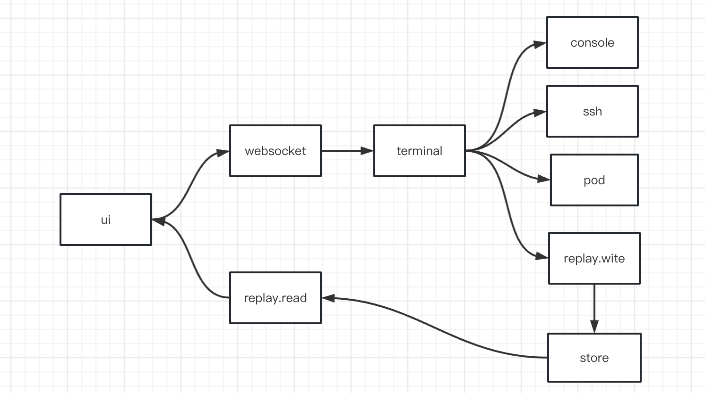
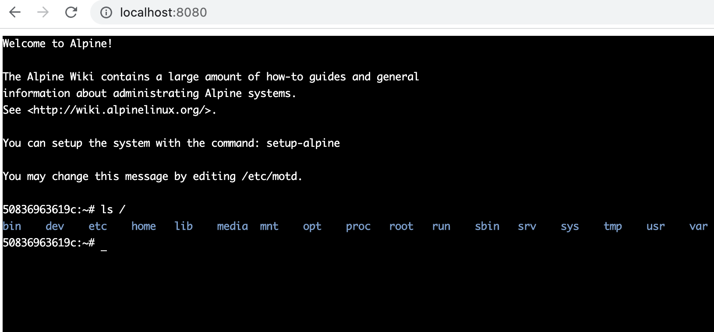

## 介绍
一个简单的web应用程序demo，用作连接到ssh服务器的ssh客户端。它是用go+xterm.js编写的。

## 模块
模块交互图

### 前端ui
使用xterm.js实现 demo版本只用了简单的html，达到效果就OK

前端有个FitAddon插件，在html版本上用了，后面还是用vue+xterm.js实现前端吧。
### 后端
从交互图上可以看出，项目有两大功能，一个是ssh交互，一个是回放。在ssh通讯的过程中，交互的数据会被保存下来，这一步要录屏。
#### websocket
前端ui与ssh服务器通讯的桥梁，
#### terminal
封装各种shell的控制台。包含本地shell、远程ssh和k8s中pod的shell
#### replay
包含录屏与回放两种功能。
## SSH服务器
本demo提供了这个模拟ssh服务的默认参数，开箱即用。
```bash
docker run -d -p 222:22 --rm bimg/alpine-ssh
```
项目地址：https://github.com/basicimage/alpine-ssh
## 效果
